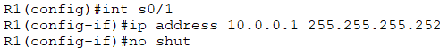
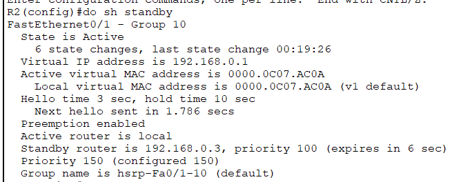
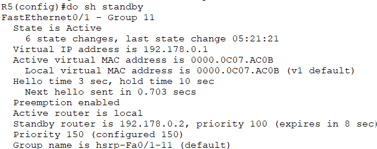
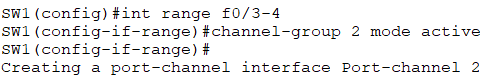
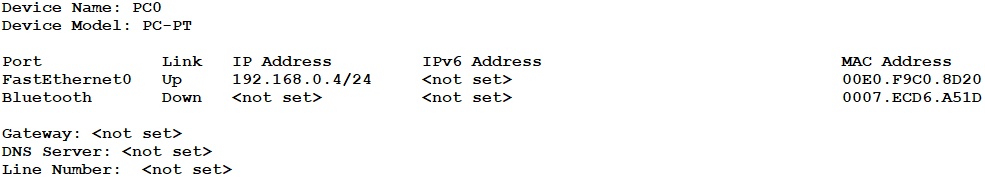

# Manual Técnico
#### Universidad de San Carlos de Guatemala 
#### Facultad de Ingeniería 
#### Escuela de Ciencias y Sistemas 
#### Redes de Computadoras 1 “N”
#### Catedrático: Ing. Pedro Pablo Hernández Ramírez 
#### Auxiliar: Melani López

### Objetivos
• Demostrar el conocimiento adquirido respecto a la agregación de enlaces.
• Demostrar el conocimiento adquirido para la creación de rutas estáticas.
• Demostrar el conocimiento adquirido respecto a la puerta de enlace
predeterminada, así como también para el manejo de protocolos de redundancia
en la misma.
• Emplear la herramienta PacketTracer para desarrollar la topología de acuerdo 
con las especificaciones dadas.


##  Configuración de routers R1, R2 y R5, configuración de switch SW1, configuración de VPC11.
### R1


### R2


### R5


### SW1


### VPC 



## Resumen de los comandos

### Creación de ruta estática
```
ip add 192.168.1.1 255.255.255.0
```

### creación de PortChannel con PAGP y LACP
#### PAGP
```
int range f0/1-2
channel-protocol pagp
channel-group 1 mode desiderable
```
#### LACP
```
int range f0/1-2
channel-protocol lacp
channel-group 1 mode active
```

### Creación de IP virtual con HSRP y GLBP
#### HSRP
```
standby 10 ip 192.168.1.254
standby 10 priority 150
standby 10 preempt
no shut
```
#### GLBP
```
glbp 1 ip 192.168.1.254
glbp 1 preempt
glbp 1 priority 150
glbp 1 load-balancing round-robin
no shut
```
### configuración de VPC


### Comandos empleados para la verificación del correcto funcionamiento de los protocolos empleados para la realización de la práctica.
```
do sh run
show etherchannel summary
```