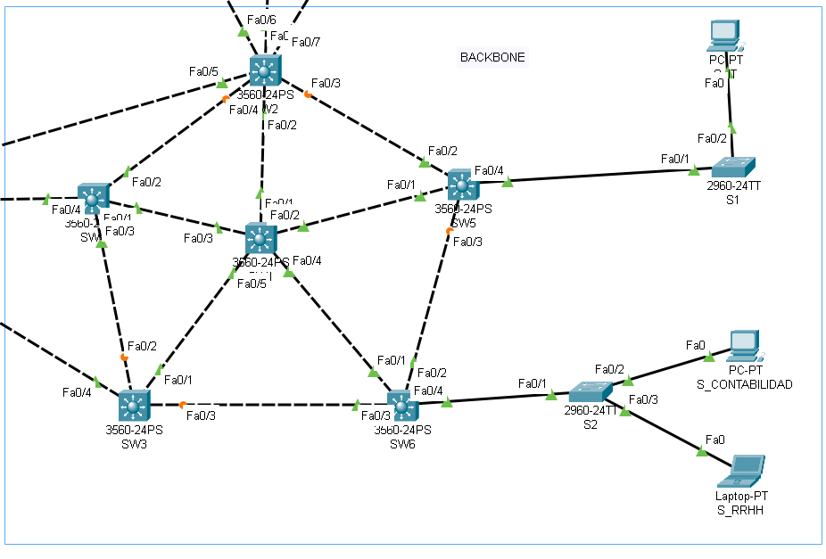

Universidad San Carlos de Guatemala

Estudiantes :  
Estudiante 1 : Andy Ezequiel Sanic Tiul 	
Estudiante 2 : Lourdes Patricia Reyes Castillo	

Carné : 202006699
Carne : 201902259
CONFIGURACIONES

RED Topologia

vista 1

 vista 2

vista 3

Configuraciones servidor
Vlan - status
VLANS

STATUS

Configuraciones clientes
Vlan - status
VLANS

Configuracion switch transparente SW9
Vlan - status
VLANS

STATUS

PINGS 

Contabilidad - Secretaria

Contabalidad 1 - Contabilidad 2

Configuracion de IP
Contabilidad 

Secretaria

RRHH

IT

